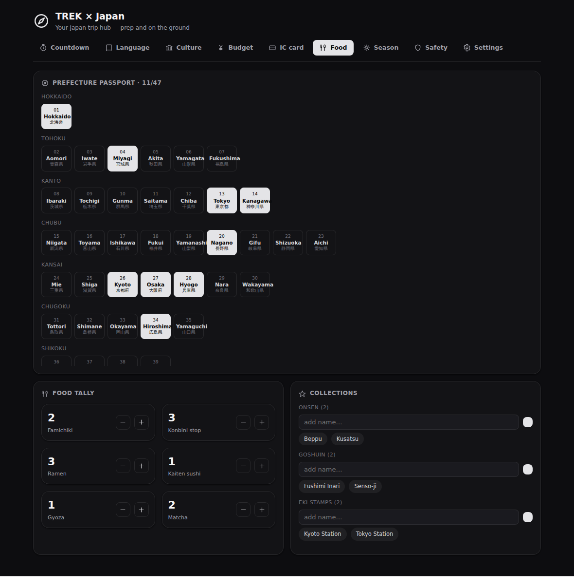

# TREK × Japan

A single-page TREK plugin that bundles everything you need to **prepare** a trip
to Japan and to **get by once you are on the ground** — organised as one hub page
with eight tab sections, a private per-user datastore, and three keyless live
data feeds.

## What it does

TREK × Japan adds a full-page tool to your TREK navigation with eight sections:

- **Countdown & checklist** — days until departure (from a linked TREK trip, or
  from the trip dates you set) plus a grouped prep/packing checklist (JR Pass,
  Pocket WiFi, IC-card app, power adapter, cash, eSIM …).
- **Language (Nihongo)** — a 46-entry travel phrasebook with a *phrase of the
  day*, per-user favourites and a category filter. Every phrase shows kanji,
  kana, Hepburn romaji and an English/German translation.
- **Culture & gomi** — 20 etiquette do's & don'ts (onsen, temple/shrine, dining,
  train, tipping) and a searchable garbage-separation helper (moeru/moenai, PET,
  cans, bottles, plastic …).
- **Yen & budget** — set a planned budget, log expenses, see spent/remaining, and
  a **live ¥ ⇄ home-currency** conversion cached from open.er-api.com.
- **IC card (Suica)** — carry your balance, charge and spend, keep a ledger, and
  get a warning below your configured threshold.
- **Food & collecting** — konbini/famichiki/ramen/kaiten counters, a **47-
  prefecture passport** (region grid) and Onsen/Goshuin/Eki-stamp collections.
- **Season & events** — average sakura and kōyō dates for major cities, plus
  matsuri/hanabi highlighted when they fall inside your travel window.
- **Safety & weather** — current weather and a 5-day forecast from
  api.open-meteo.com, recent earthquakes from the JMA feed, and quick-access
  emergency phrases.

Everything is local-first: the datasets ship inside the plugin and all state is
stored per user in the plugin's own database. Network calls are limited to three
free, keyless endpoints and their results are cached, so the page renders fast.
The UI is drawn entirely with inline SVG (no bundled images or web fonts, per
TREK's sandbox), follows the host's light/dark theme, and speaks English and
German off the TREK locale.

## Screenshots

The hub in light and dark, opened on the prefecture passport:

### Every section

**Countdown & checklist** — days to departure and a grouped prep list.

**Language (Nihongo)** — phrase of the day, favourites and category filter.

**Culture & gomi** — etiquette cards and a searchable garbage-sorting table.

**Yen & budget** — planned budget, expenses and live ¥ ⇄ home-currency FX.

**IC card (Suica)** — balance, charge/spend, low-balance warning and ledger.

**Food & collecting** — food counters, the 47-prefecture passport and collections.

The same section in dark theme:

**Season & events** — sakura/kōyō dates and matsuri in your travel window.

**Safety & weather** — live weather, JMA earthquakes and emergency phrases.

**Settings** — currency, IC card, weather coordinates and trip window.

## Permissions

This plugin requests the following permissions, each for a specific reason:

| Permission | Why it is needed |
|---|---|
| `db:own` | Stores all per-user state (checklist, favourites, visited prefectures, IC balance & ledger, budget & expenses, food tally, collections, your preferences) and the API response caches in the plugin's own private SQLite database. |
| `db:read:trips` | Reads the start/end dates of a linked TREK trip (membership-checked, in the route handler) so the countdown and the season section can use your real trip window instead of a manually entered date. |
| `http:outbound` | The base marker declaring that the plugin makes outbound HTTP requests. On its own it reaches no host — the specific hosts below are what actually open. |
| `http:outbound:api.open-meteo.com` | Fetches current weather and the 5-day forecast for your configured location (Open-Meteo, no API key). |
| `http:outbound:open.er-api.com` | Fetches JPY exchange rates for the live yen ⇄ home-currency conversion in the budget section (open.er-api.com, no API key). |
| `http:outbound:www.jma.go.jp` | Fetches the recent-earthquake list from the Japan Meteorological Agency (`www.jma.go.jp/bosai/quake/data/list.json`, no API key). |

Each outbound host is declared **both** as an `http:outbound:<host>` permission
and in `egress[]` (identical lists), which is what the runtime network guard and
the iframe CSP are built from. All three endpoints are free and keyless. A future
update that adds more permissions will require an admin to re-approve the plugin.

## Setup

1. Install the plugin from the TREK plugin store (Admin → Plugins → Discover) and
   activate it, approving the permissions above.
2. Open **TREK × Japan** from the top navigation and go to the **Settings** tab.
3. Set your **home currency** and (optionally) your **IC card** type and the
   **low-balance threshold** in yen.
4. For weather, enter the **latitude and longitude** of the city you want to
   track (e.g. Tokyo `35.68 / 139.76`); the city name field is just a label.
5. To drive the countdown and season window either enter a **TREK trip ID** (its
   dates are read live and membership-checked) or set **trip start/end** dates
   directly.
6. Everything else works immediately — the phrasebook, etiquette, gomi search,
   food/prefecture/collection trackers, and the cached FX/weather/quake feeds.

## License

MIT — see [LICENSE](LICENSE).
