# TREK × Japan

A **collaborative, in-trip** hub for a Japan trip. It mounts as a tab **inside a
TREK trip planner** (a `trip-page`, TREK 3.2.1+), so it is always scoped to the
open trip — and the planning data is **shared by every trip member**. One person
sets the budget, another logs an expense, a third stamps a prefecture, and
everyone sees the same board with **who did what**. Genuinely personal things —
your Suica balance, your phrase favourites, your display currency — stay private
to you.

## What it does

TREK × Japan adds a tab inside the trip planner, sorted into the trip's natural
flow — first **prep** (before you fly), then **on the ground** (during the trip).
Data is either **shared** with the whole trip or **personal** to you:

**Prep**

- **Countdown & checklist** *(shared)* — days until departure from the trip's own
  dates, plus a grouped prep/packing checklist (JR Pass, Pocket WiFi, IC-card
  app, adapters, cash, eSIMs …). Every item shows which member ticked it.
- **Season & events** *(shared window)* — average sakura and kōyō dates for major
  cities (sorted by bloom date), plus matsuri/hanabi highlighted when they fall
  inside the trip's dates.
- **Culture & gomi** *(reference)* — 20 etiquette do's & don'ts (onsen,
  temple/shrine, dining, train, tipping) and a searchable garbage-separation
  helper (moeru/moenai, PET, cans, bottles, plastic …).
- **Language (Nihongo)** *(personal favourites)* — a 46-entry travel phrasebook
  with a *phrase of the day*, your own favourites and a category filter. Each
  phrase shows kanji, kana, Hepburn romaji and an English/German translation.

**On the ground**

- **Yen & budget** *(shared)* — the trip's planned budget and a shared expense
  log (each entry tagged with the member who added it), spent/remaining, and a
  **live ¥ ⇄ your-currency** conversion cached from open.er-api.com.
- **IC card (Suica)** *(personal)* — your own balance, charge/spend, a ledger and
  a warning below your threshold. Every traveller has their own card.
- **Food** *(shared)* — konbini/famichiki/ramen/kaiten/gyoza/matcha counters for
  everything the group eats along the way.
- **Passport** *(shared)* — a **47-prefecture passport** the group stamps
  together (each stamp shows who added it), plus Onsen/Goshuin/Eki-stamp
  collections.
- **Safety & weather** *(shared location)* — current weather and a 5-day forecast
  from api.open-meteo.com for the trip's weather location, recent earthquakes
  from the JMA feed, and quick-access emergency phrases.

**Deep TREK 3.2.1 integration.** Beyond its own shared board, the hub plugs into
the trip planner itself: it reads the trip's **native packing list** and
**files**, mirrors expenses into TREK's **native budget** (Costs addon) and reads
them back, turns a matsuri or city into a **planner place** (creating days and
assignments), pins shared tips and place notes via **trip meta**, enriches a
place's **detail panel** and raises **planner warnings** (no weather set, budget
exceeded, Golden Week / New Year / Obon crowding), keeps a **live activity feed**
from core trip events, and broadcasts changes to other TREK clients. Every one of
these degrades gracefully when an addon or edit-permission is missing.

Everything is local-first: the datasets ship inside the plugin and all state
lives in the plugin's own database. Network calls are limited to three free,
keyless endpoints and their results are cached, so the tab renders fast. The UI
is drawn entirely with inline SVG (no bundled images or web fonts, per TREK's
sandbox), follows the host's light/dark theme, and speaks English and German off
the TREK locale.

## Screenshots

The hub in light and dark, opened on the shared prefecture passport:

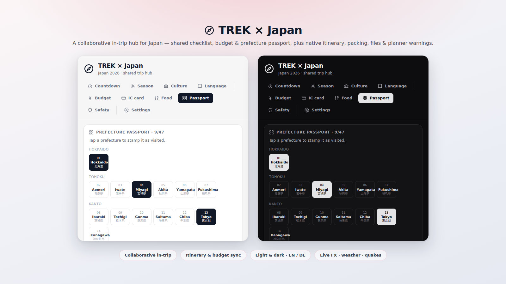

### Prep

**Countdown & checklist** — days to departure and a shared prep list showing who ticked each item.

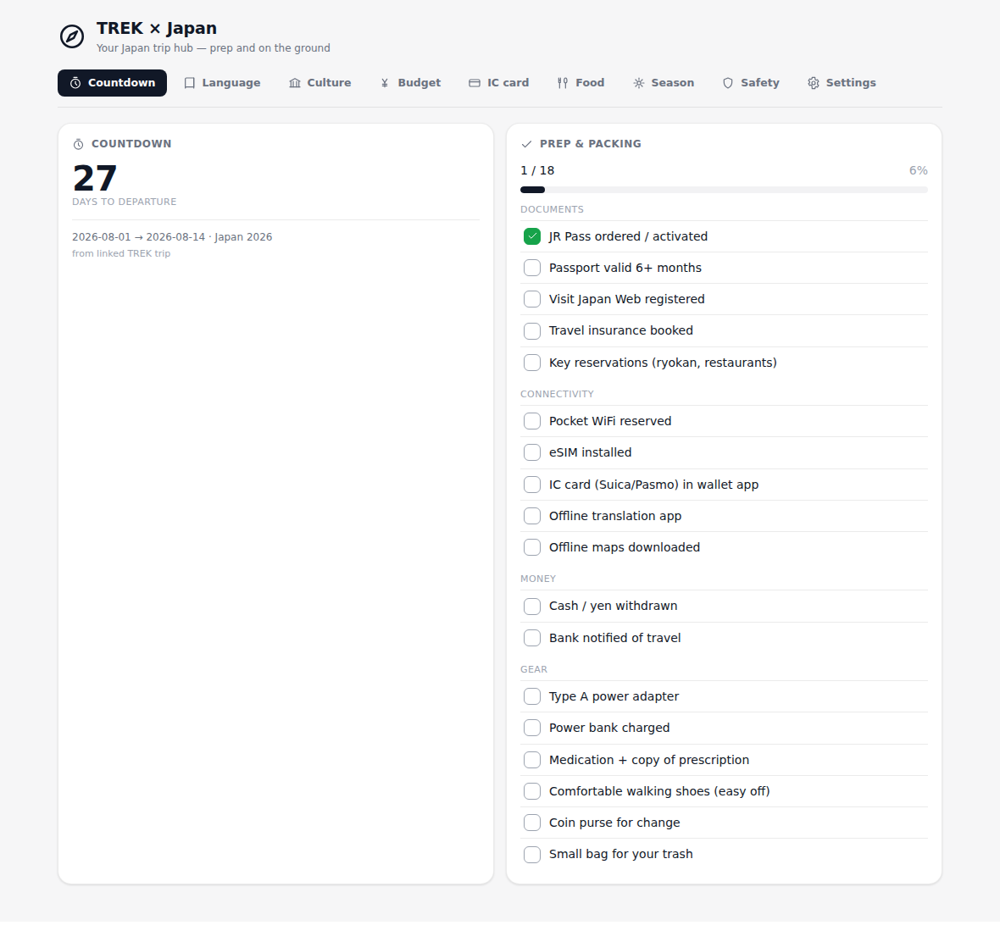

**Season & events** — sakura/kōyō dates and matsuri inside the trip's window.

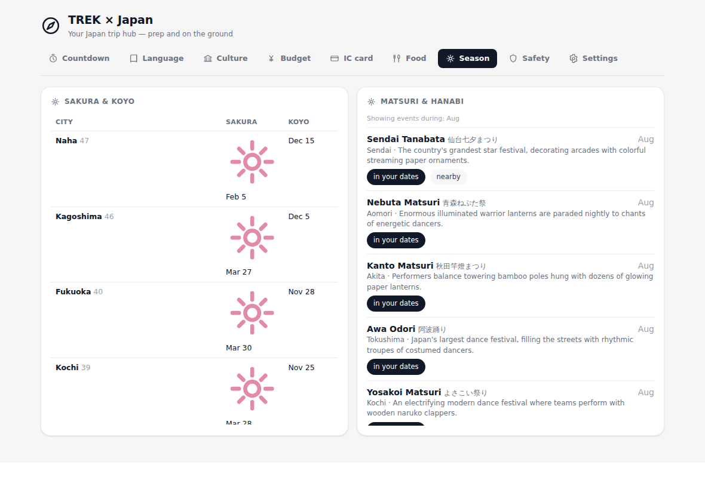

**Culture & gomi** — etiquette cards and a searchable garbage-sorting table.

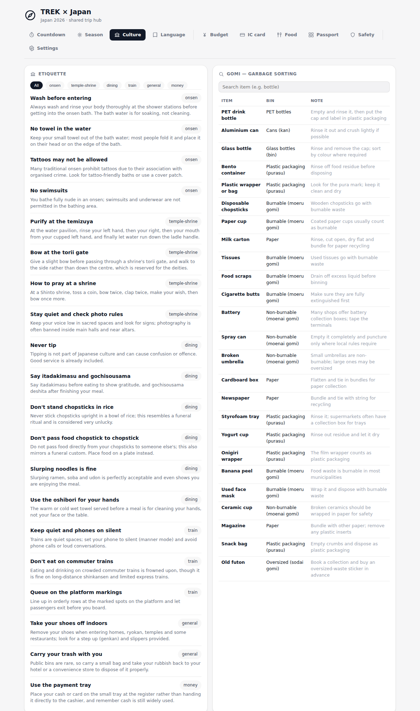

**Language (Nihongo)** — phrase of the day, personal favourites and category filter.

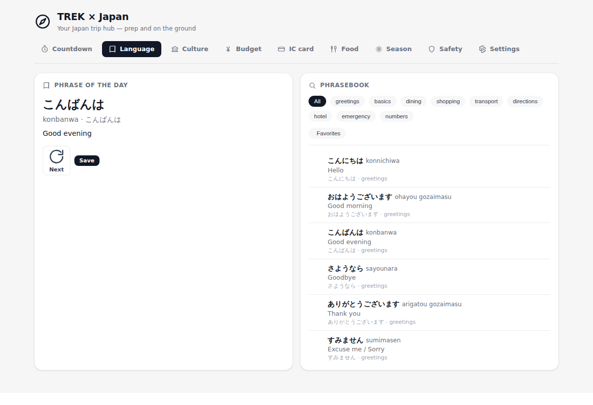

### On the ground

**Yen & budget** — shared budget and expenses (tagged per member) with live ¥ ⇄ home-currency FX.

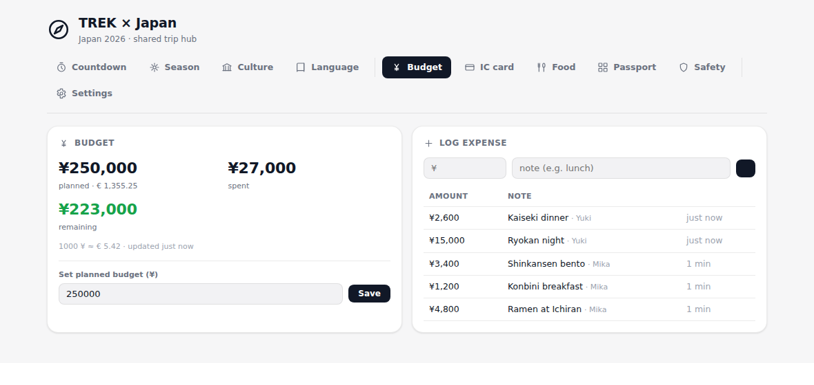

**IC card (Suica)** — your personal balance, charge/spend, low-balance warning and ledger.

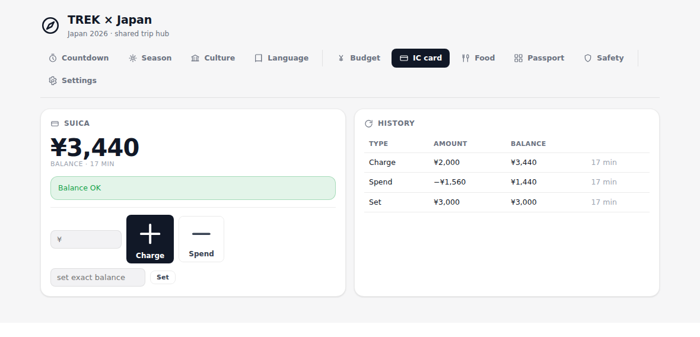

**Food** — shared konbini/ramen/kaiten counters for everything the group eats.

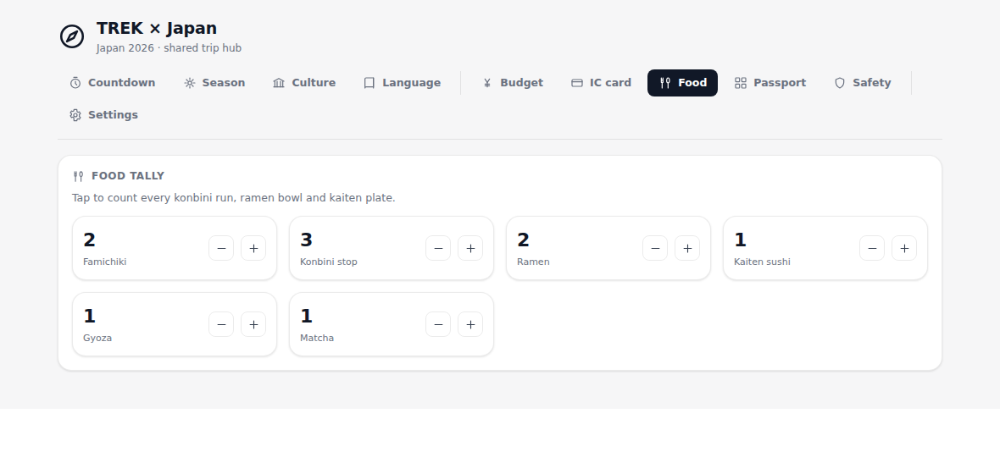

**Passport** — the shared 47-prefecture passport (who stamped what) and Onsen/Goshuin/Eki collections.

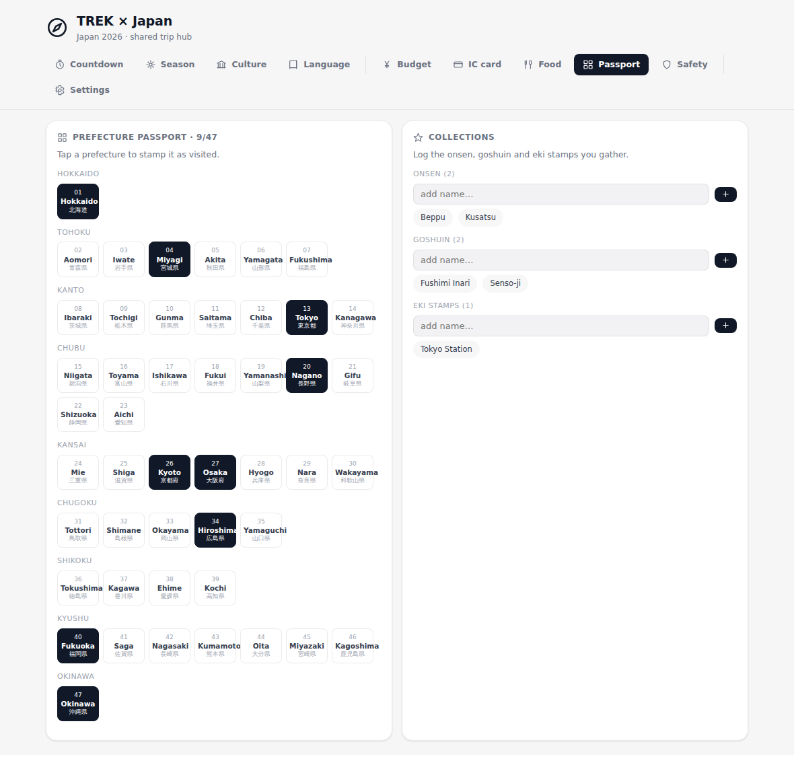

The passport in dark theme:

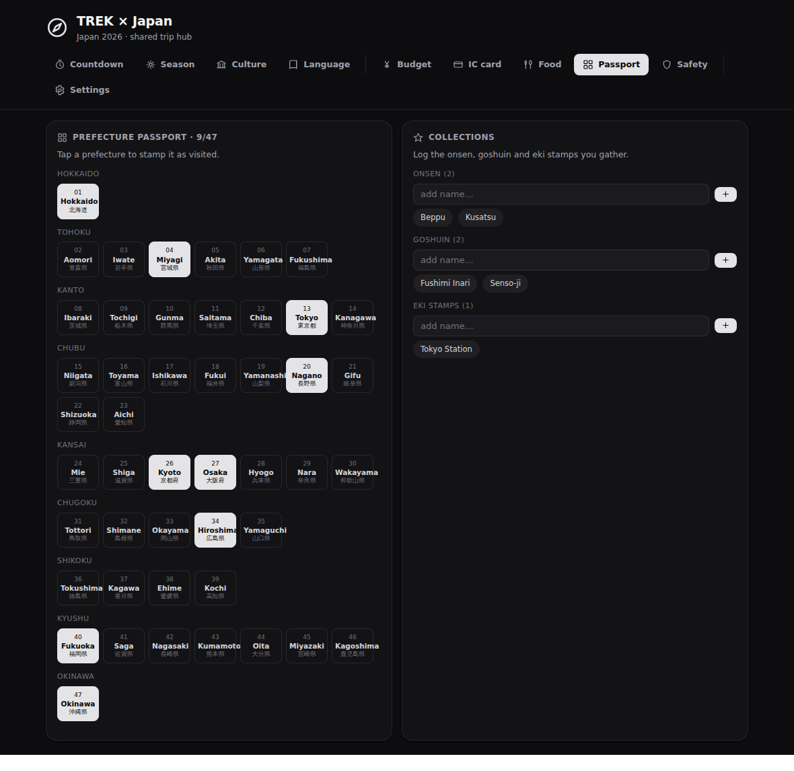

**Safety & weather** — live weather, JMA earthquakes and emergency phrases.

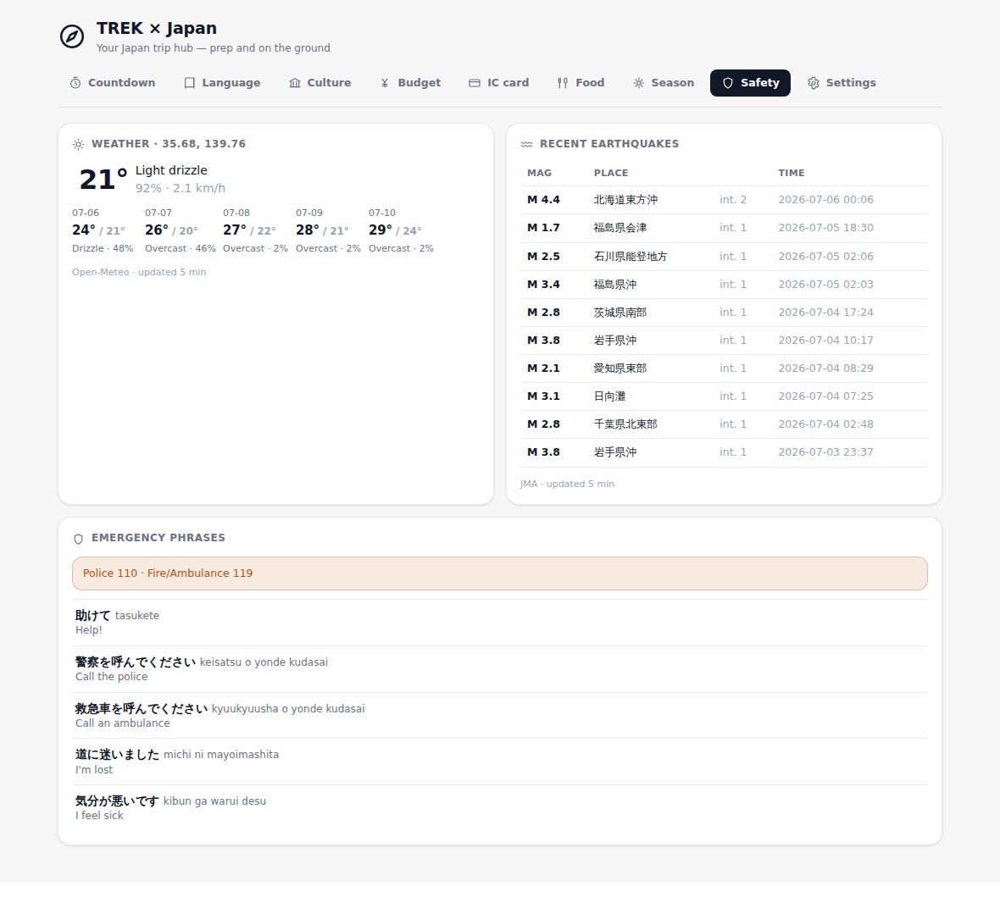

### Settings

**Settings** — personal preferences (currency, IC card) and the trip-shared weather location.

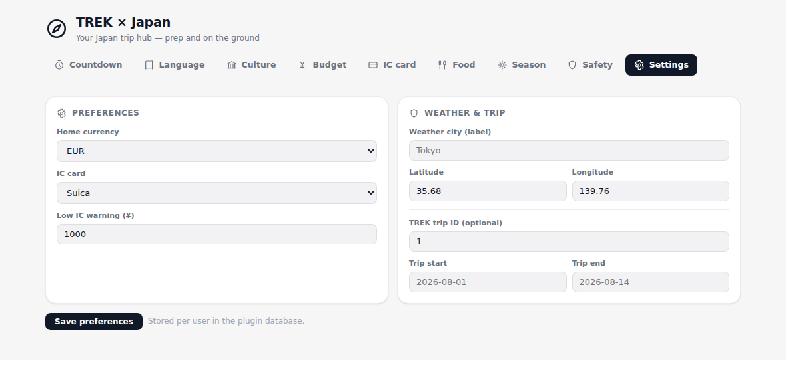

## Permissions

This plugin requests the following permissions, each for a specific reason:

| Permission | Why it is needed |
|---|---|
| `db:own` | Stores everything in the plugin's own private SQLite database: **shared, per-trip** data (checklist, budget & expenses, food tally, prefecture passport, collections, weather location, activity feed) and **personal, per-user** data (IC balance & ledger, phrase favourites, display preferences), plus the API response caches. |
| `db:read:trips` | Membership-checks the acting user on **every shared route** (`ctx.trips.getById`) so only trip members reach that trip's board, reads the trip's dates for the countdown/season window, and lists current planner places (`ctx.trips.getPlaces`). |
| `db:read:users` | Resolves trip co-members' display names for the collaboration labels — the "added by / checked by / stamped by" tags. Returns only you and your trip co-members. |
| `db:read:packing` | Shows the trip's **native TREK packing list** (`ctx.packing.list`) next to the plugin's prep checklist, scoped to what you may see. |
| `db:read:files` | Shows the trip's **files/documents** (`ctx.files.list`) — JR Pass voucher, hotel confirmations — in the prep view. |
| `db:read:costs` | Reads the trip's **native budget items** (`ctx.costs.getByTrip` / `listMine`) to show them alongside the plugin's shared expenses. Requires the Costs addon. |
| `db:write:costs` | Creates/updates/deletes native budget items (`ctx.costs.*`) and pushes plugin expenses into TREK's real budget. Needs the Costs addon + your `budget_edit`. |
| `db:write:trips` | Optional one-tap "set trip currency to JPY" (`ctx.trips.update`). Needs your `trip_edit`. |
| `db:write:places` | "Add to planner" creates a place in the trip from a matsuri/city (`ctx.places.create` / `update` / `delete`). Needs your `place_edit`. |
| `db:write:days` | Creates/edits itinerary days when scheduling an added event (`ctx.days.*`). Needs your `day_edit`. |
| `db:write:itinerary` | Assigns/unassigns an added place to a day (`ctx.itinerary.assign` / `unassign`). Needs your `day_edit`. |
| `db:meta` | Pins shared trip tips and tags plugin-created places with a note (`ctx.meta.*`), stored in the plugin's own namespace on the trip/place. |
| `events:subscribe` | Subscribes to core trip events (`place:created`, `file:created`, `day:updated`, …) to build the **live activity feed**. |
| `ws:broadcast:trip` | Notifies the trip's TREK clients when the shared board changes (checklist, expenses, prefectures, pinned tips). |
| `ws:broadcast:user` | Notifies your own TREK clients when your personal IC balance changes. |
| `hook:place-detail-provider` | Enriches a place's detail panel in the planner with the note the plugin pinned to it (`placeDetailProvider.getDetails`). |
| `hook:trip-warning-provider` | Raises planner warnings from the plugin's state (`warningProvider.getWarnings`) — e.g. no weather location set, budget exceeded, Golden Week / New Year / Obon crowding. |
| `http:outbound` | Base marker declaring outbound HTTP. On its own it reaches no host — the specific hosts below are what open. |
| `http:outbound:api.open-meteo.com` | Current weather and the 5-day forecast for the trip's weather location (Open-Meteo, no API key). |
| `http:outbound:open.er-api.com` | JPY exchange rates for the live yen ⇄ home-currency conversion (open.er-api.com, no API key). |
| `http:outbound:www.jma.go.jp` | The recent-earthquake list from the Japan Meteorological Agency (`www.jma.go.jp/bosai/quake/data/list.json`, no API key). |

The native-budget features (`ctx.costs.*`) need TREK's **Costs (budget) addon**
enabled on the trip; everything else works without it and degrades gracefully.
Each outbound host is declared **both** as an `http:outbound:<host>` permission
**and** in `egress[]` (identical lists), which is what the runtime network guard
and the iframe CSP are built from. All three endpoints are free and keyless. This
is a broad permission set — a version that adds still more will require an admin
to re-approve the plugin.

## Setup

1. Requires **TREK 3.2.1+** (the `trip-page` plugin type). Install the plugin
   from the plugin store (Admin → Plugins → Discover) and activate it, approving
   the permissions above.
2. Open any **trip** in the planner — **TREK × Japan** appears as a tab inside
   that trip. Everything is automatically scoped to that trip; there is nothing
   to link by hand.
3. Open the **Settings** tab and set your **personal** preferences: home
   currency, IC-card type and the low-balance threshold (these are yours alone).
4. Still in Settings, set the **trip weather location** (latitude/longitude of
   the destination, e.g. Tokyo `35.68 / 139.76`); this is **shared** and drives
   the Safety tab for everyone on the trip.
5. That's it — invite your travel companions to the trip and plan together: the
   checklist, budget, food counters, prefecture passport and collections are all
   shared and show who did what, while your IC card and phrase favourites stay
   personal.

## License

MIT — see [LICENSE](LICENSE).
